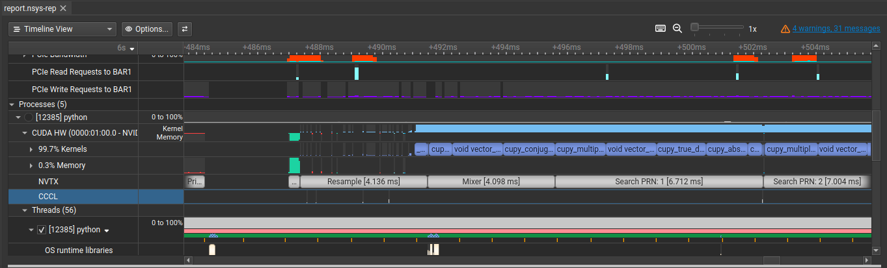
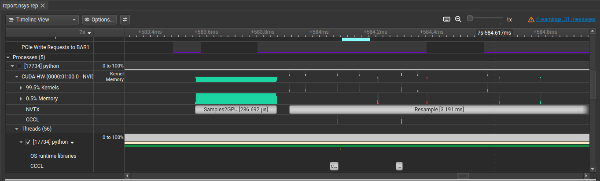
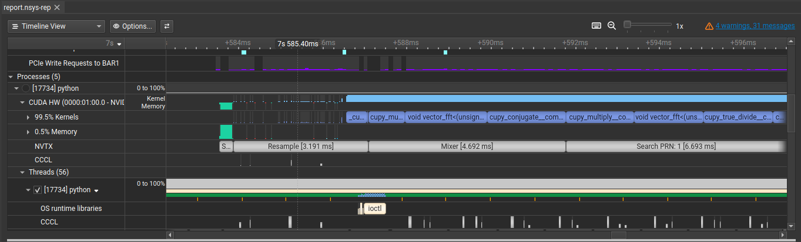
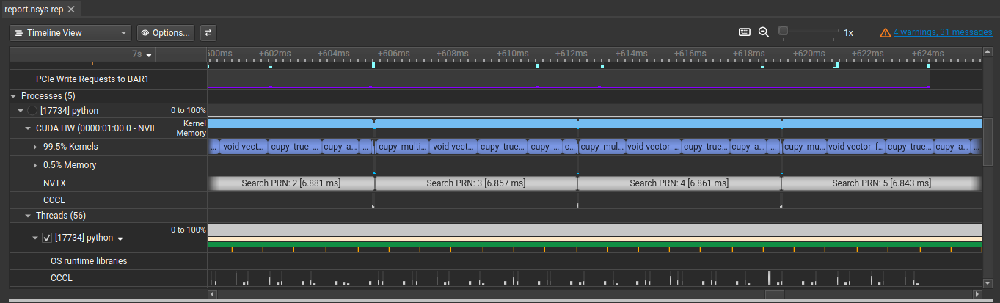
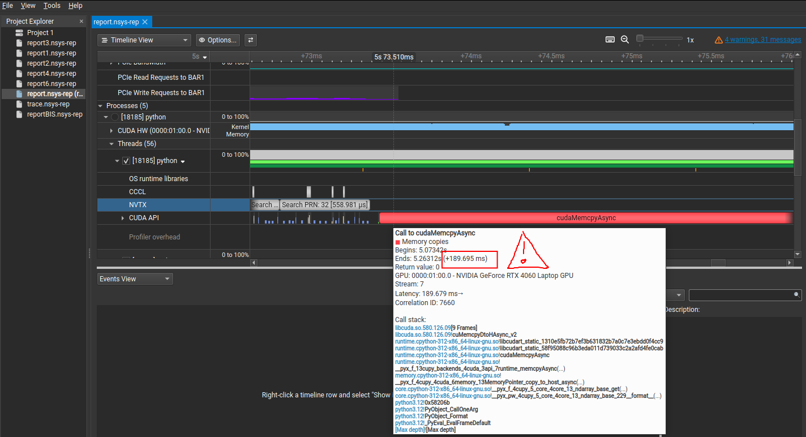

+++
title = "GPS L1 C/A Acquisition accelerated with CUDA"
date = "2026-04-20"
description = "Article explaining how I ported the GPS L1 C/A acquisition from GNSS-DSP-tools (by Peter Monta) to code that can be accelerated with an Nvidia GPU using CUDA"
tags = [
    "GNSS",
    "GPS L1 C/A",
    "RF",
    "Acquisiton",
    "CUDA",
    "NVIDIA",
]
+++


## Motivation

The other day I was reading Daniel Estévez's [post](https://destevez.net/2025/12/first-analysis-of-the-lunar-gnss-receiver-experiment-data/) about the [Lunar GNSS Receiver Experiment (LuGRE)](https://etd.gsfc.nasa.gov/our-work/lunar-gnss-receiver-experiment-lugre/), which is a project where NASA and the Italian Space Agency landed a GPS receiver on the moon. The receiver is also capable of recording, so in his post Daniel takes the IQ recordings and codes a CUDA-accelerated script to acquire the GPS satellites with high sensitivity. He goes on to explain the acquisition algorithm, the implementation and discusses the results. As per usual, it's very well written, I suggest you check it out.

For the implementation, he starts-off with a proof of concept using Python and the CuPy library, which is a GPU array backend that implements a subset of the NumPy interface (and some SciPy too). It takes the NumPy functions you know and love and replicates them but running on the GPU instead of running on the CPU. To do it, CuPy utilizes the CUDA Toolkit libraries (like cuFFT, cuBLAS, etc). Once Daniel validates the proof of concept with the higher-level Python script, he goes on to write custom CUDA kernels.

I’ve worked in the past with GPS tracking engines, but I’ve always wanted to spend time on the acquisition side. On top of that, I’ve been wanting to learn CUDA for quite a while. So reading Daniel’s post inspired me. I told myself: “grab Peter Monta’s [GNSS-DSP-tools](https://github.com/pmonta/GNSS-DSP-tools) library, which is pretty standard (we use it where I work, and Daniel himself has used it in several posts) and port it to CuPy. That's a good learning exercise.”. This has the advantage that I can focus on the algorithmic part, since the library provides everything else. And if I end up getting good results, since it’s a well-known library, my code might be useful to someone. And of course, I stay in Python, so I don’t have to invest more time than I have into low-level CUDA kernels in C++.

So, in summary:

**This post's objective**: To port [`acquire-gps-l1.py`](https://github.com/pmonta/GNSS-DSP-tools/blob/master/acquire-gps-l1.py) to CuPy. Profile and optimize it. Squeeze every millisecond to see if real-time could be achieved. But stay in Python. Most importantly, enjoy the process. And then, to show *you* the results.

> **Disclaimer:** This is not a post showing state of the art results or anything better than what Daniel or Peter alread have, nor a rigorous implementation guideline. My knowledge is limited and it's my first time with CUDA. There may be mistakes. I just want to share my journey GPU-accelerating the GPS acquisition algorithm.

## Software set up

1. Install CUDA on a CUDA-capable GPU, following the instructions from the [official CUDA website](https://www.google.com/url?sa=t&source=web&rct=j&opi=89978449&url=https://docs.nvidia.com/cuda/cuda-installation-guide-linux/). With the CUDA install will come the profiling tool, NVIDIA Nsight Systems.
2. Then, install CuPy as detailed [here](https://docs.cupy.dev/en/stable/install.html). I recommend to do it in a virtual environment.
3. Clone the GNSS-DSP-tools repo from [Peter Monta's github](https://github.com/pmonta/GNSS-DSP-tools).
4. This [post's script](cuAcq.py).

## Testing set up

Also known as: how to iterate knowing the ground truth you're trying to reach. For this, I have also used one of Daniel Estevez's [posts](https://destevez.net/2022/03/timing-sdr-recordings-with-gps/). In it, he records some seconds of L1 and decodes the LNAV navigation data for timing purposes. But decoding is a different topic. What interests me is the first part, where he provides the RF recording at 4 Msps and runs it through the GNSS-DSP-tools acquisition algorithm. I have reproduced those results locally. Those are the results I will try to replicate with my GPU-accelerated version. I'm copying them here for the reader's convenience:

```bash
$ ./acquire-gps-l1.py GPS-L1-2022-03-27.cs8 4000000 0
prn   1 doppler   600.0 metric  1.58 code_offset  393.4
prn   2 doppler  1800.0 metric  3.19 code_offset  758.8
prn   3 doppler -1200.0 metric  1.65 code_offset 1004.0
prn   4 doppler  1000.0 metric  1.50 code_offset  475.0
prn   5 doppler   800.0 metric  1.61 code_offset  964.8
prn   6 doppler  1800.0 metric  1.54 code_offset  153.4
prn   7 doppler -4200.0 metric  1.53 code_offset  259.5
prn   8 doppler  -200.0 metric  1.53 code_offset  830.4
prn   9 doppler  6800.0 metric  1.49 code_offset  134.6
prn  10 doppler -7000.0 metric  1.58 code_offset  783.7
prn  11 doppler  2400.0 metric  7.22 code_offset  185.8
prn  12 doppler  -200.0 metric  7.98 code_offset  151.6
prn  13 doppler   800.0 metric  1.62 code_offset  881.4
prn  14 doppler -1200.0 metric  1.50 code_offset  123.1
prn  15 doppler -4200.0 metric  1.53 code_offset  813.5
prn  16 doppler  -200.0 metric  1.53 code_offset  285.2
prn  17 doppler  3600.0 metric  1.47 code_offset  940.3
prn  18 doppler  1800.0 metric  1.51 code_offset  860.9
prn  19 doppler  3800.0 metric  1.51 code_offset  421.1
prn  20 doppler  1000.0 metric  1.59 code_offset  956.3
prn  21 doppler -5200.0 metric  1.58 code_offset  438.3
prn  22 doppler  2600.0 metric  5.33 code_offset  465.0
prn  23 doppler -4200.0 metric  1.59 code_offset  272.2
prn  24 doppler  3000.0 metric  1.55 code_offset  605.9
prn  25 doppler  1600.0 metric  6.99 code_offset  425.1
prn  26 doppler -5000.0 metric  1.52 code_offset  149.6
prn  27 doppler -1200.0 metric  1.48 code_offset  404.9
prn  28 doppler  2800.0 metric  1.51 code_offset  128.6
prn  29 doppler  4000.0 metric  1.65 code_offset  603.2
prn  30 doppler -2200.0 metric  1.50 code_offset 1012.0
prn  31 doppler  5200.0 metric  6.86 code_offset  559.7
prn  32 doppler  1000.0 metric  7.18 code_offset  680.3
```

## Implementation & results

### Resampling

Regardless of the sample rate of the recording, the script will resample to a canonical 4.096 Msps. That sample rate is high enough for the PRN code and a power of 2, required for FFT efficiency. As one can observe by looking at the code, the resampling has not been altered with respect to the original GNSS-DSP-tools script. Thus, it is computed on the CPU.

If one looks at the time it takes to resample, it's more than 150 ms. The milliseconds of samples to run the acquisition is 80. Just the resampling on the CPU would prevent you to achieve real-time.



The profiling tool is NVIDIA Nsight Systems. I use a simple bash script to (1) run the Python script in profile mode, (2) store the profiling stats with a fixed name (overwritting if the file existed in the directory) and (3) open those profiling stats with the tool. You may find it useful:

```bash
sudo nsys profile \
  --output report.nsys-rep \
  --force-overwrite=true \
  --gpu-metrics-device=all \
  -t cuda,nvtx,osrt \
  /home/dmlb/.virtualenvs/cudaDev/bin/python cuAcq.py &&\
  nsys-ui report.nsys-rep
```

### Move samples to GPU

The interface to move an array into GPU memory is the same as NumPy: call `asarray` from CuPy, and it will move the data you give it (a list, a NumPy array, etc) to the GPU.

Moving the 80 milliseconds (to perform non-coherent integration) on the resampled sample rate (of 4.096 Msps) means moving 5.24 MB of data. The driver first calls cudaHostAlloc, I assume to allocate enough bytes of host memory that is page-locked, accessible to the device. It takes more than 2 ms, which is quite a lot, but I assume that this only needs to be done once. If more batches of samples were to be used, they could use that same host memory. At any rate: this accelerates further calls to cudaMemcpyAsync, which you can see in red, very tiny, because it spans only ~30 us.




### Mixer

GNSS-DSP-tools uses an NCO (Numerically-Controlled Oscillator) to mix signals. An NCO is a digital sine/cosine wave generator. When performing acquisition, you need to generate a local carrier replica to mix against (correlate with) the incoming signal to strip the carrier and find the doppler shift.

The way it's performed is by precomputing one full cycle of a complex exponential (a phasor) at NT=1024 uniformly spaced points around the unit circle. It's just a lookup table (LUT) of cos + j·sin values, computed only once.

Having the LUT computed, one calls the NCO with a frequency per sample `f`, a phase (in sample units) `p` and the number of samples `n` for which we will want to do the mixing. This will return an array of phasors were each sample you advance the phase by `f`. The NCO in GNSS-DSP-tools works by giving a doppler per sample. I have extended it so that you can pass an array of dopplers per sample (all doppler search bins, which in this case is from -7 KHz to +7 KHz in steps of 200 Hz).

As the reader will see in the code, the LUT is computed once on the GPU. I haven't bothered on timing its computation, since it's lightweight and only computed once.

What is computed on every acquisition step is the actual mixing. The mixer signals have been precomputed as I explained in the last paragraph, but the mixing is the multiplication of the input samples by the mixer signal. As you can see by looking at the code, I also transform it into the frequency domain by calling the FFT.

In the following image I have pasted two identical runs of the mixer function. As you can see, the first one is an order of magnitude slower. That is because CUDA needs to load the module into the GPU, subsequent calls to the function will go much faster. In my use case, where I have a Laptop RTX 4060, a runtime of ~300 us is amazing in my humble opinion. Let us not remember that these 300 us include:

1. Multiplying the input samples by all mixer signals (the whole doppler range of bins). This yields an array of shape (80, 70, 4096), where 80 is the accumulated ms for the acquisiton run, 70 the number of doppler bins in the range of -7 KHz to +7 KHz in steps of 200 Hz, and 4096 the samples in a millisecond. And;
2. Running the FFT, which moves it into the frequency domain.

Incredible what a "cheap" consumer-grade GPU is capable of. But that's not all, there's still the PRN search.



### PRN search

The PRN codes are precomputed and transformed into the frequency domain by applying the FFT. The PRN codes are obtained using GNSS-DSP-tools' `ca.code` function, and that is done for all 32 PRNs. Thus, the variable `ca_codes` you see in the code is a (32, 4096) array in the frequency domain that already resides in GPU memory. Every time you need a given PRN, you just index it from the array (note that PRNs start counting at 1 and array indexes at 0).

When looking at the `search` function, you can see that no for loops are used. That's different with respect to Peter Monta's original implementation. That's mainly because the signal is already transformed into frequency domain with shape (ms_accumulated, doppler_bins, n_samples_1ms), which in this case is (80, 70, 4096). Thus, correlation by the PRN code (shaped (1, 4096)) for all milliseconds and all doppler bins is only a multiplication. Same thing with the inverse FFT needed to bring back the correlation results into the time domain. These massive computations, lovely abstracted by CuPy, are extremely optimized by CUDA. The only difficulty I found was understanding array indexing notation. That took some trial and error, but having the testing set up so that every step is comparable with what you get with GNSS-DSP-tools, it's doable.

Performance-wise, a similar thing happens with the mixer: the first run is slow because CUDA has to load the module into the GPU, but subsequent runs are incredibly fast, with averages of **~700 us per PRN**. Sub 1 millisecond per PRN is great, specially taking into account that a real receiver needn't have all PRNs under acquisition at the same time.



## Acquisition results

Printing the results of the acquisition run with CUDA, in the same format as with GNSS-DSP-tools, looks like this:

```bash
prn   1 doppler -3200.0 metric  1.54 code_offset  142.6
prn   2 doppler  1800.0 metric  3.19 code_offset  758.8
prn   3 doppler -1200.0 metric  1.65 code_offset 1004.0
prn   4 doppler  6400.0 metric  1.39 code_offset  521.7
prn   5 doppler   800.0 metric  1.61 code_offset  964.8
prn   6 doppler  1800.0 metric  1.54 code_offset  153.4
prn   7 doppler -3000.0 metric  1.38 code_offset  806.2
prn   8 doppler  3600.0 metric  1.53 code_offset  147.9
prn   9 doppler  4800.0 metric  1.48 code_offset  376.6
prn  10 doppler -5200.0 metric  1.54 code_offset  544.0
prn  11 doppler  2400.0 metric  7.22 code_offset  185.8
prn  12 doppler  -200.0 metric  7.98 code_offset  151.6
prn  13 doppler   800.0 metric  1.62 code_offset  881.4
prn  14 doppler  6600.0 metric  1.41 code_offset  578.4
prn  15 doppler -4200.0 metric  1.53 code_offset  813.5
prn  16 doppler  4600.0 metric  1.41 code_offset  253.8
prn  17 doppler -4400.0 metric  1.42 code_offset  624.1
prn  18 doppler  1800.0 metric  1.51 code_offset  860.9
prn  19 doppler -5000.0 metric  1.48 code_offset  146.4
prn  20 doppler  2800.0 metric  1.54 code_offset  169.6
prn  21 doppler -5200.0 metric  1.58 code_offset  438.3
prn  22 doppler  2600.0 metric  5.33 code_offset  465.0
prn  23 doppler -7000.0 metric  1.53 code_offset  371.9
prn  24 doppler  2600.0 metric  1.52 code_offset  508.3
prn  25 doppler  1600.0 metric  6.99 code_offset  425.1
prn  26 doppler -2000.0 metric  1.29 code_offset  364.9
prn  27 doppler -1200.0 metric  1.48 code_offset  404.9
prn  28 doppler  6800.0 metric  1.51 code_offset  712.8
prn  29 doppler -3200.0 metric  1.50 code_offset  470.0
prn  30 doppler  6800.0 metric  1.45 code_offset  708.3
prn  31 doppler  5200.0 metric  6.86 code_offset  559.7
prn  32 doppler  1000.0 metric  7.18 code_offset  680.3
```

The PRNs present in the recording are those with metrics above 2. Below 2, it's noise. They are: 2, 11, 12, 22, 25, 31 and 32. As you can see doppler, code delay and metric are exactly the same as in the original GNSS-DSP-tools script. The are value differences in the ones that are noise. I blame that to the lower resolution datatypes used in CUDA to speed computations (ie using a float where a double is overkill).

## The time difference

On my PC, running Peter Monta's `acquire-gps-l1.py` for all 32 PRNs takes around **~3.5 seconds**. Note that he uses the multiprocessing library to make use of the different cores in your computer, so you mileage may vary. Running my CUDA-accelerated version of his script takes **~20 milliseconds** on the RTX 4060.

> Note 1: In neither the time of the resampling has been taken into account.

> Note 2: You will see that, in order to get representative timings, I have forced the load of some modules previous to starting the timer. It is marked in the code comments.

## Next steps

1. Porting the resampler to the GPU: It's not straight away because `firwin` and `filtfilt` have not, to my knowledge, been implemented in CuPy. That requires me to do it by hand from lover level CuPy calls, which takes time, and I wanted to focus on the doppler and code delay part.

2. Batching the PRN search: Instead of one call to `search` per PRN, it would be interesting to try and batch multiple PRN searches and do them in one call. Perhaps one call to cuFFT with a large array is faster than several calls with smaller arrays. It needs to be tested, I'm not an expert on the optimizations of cuFFT.

3. Dive deeper in the retrieval of data from GPU to CPU: when printing the acquisition results at the end, they are moved from the GPU to the CPU. This triggers a `cudaMemcpyAsync` of more than 150 ms, which I reckon is humongous for the little amount of data that is actually being moved.

