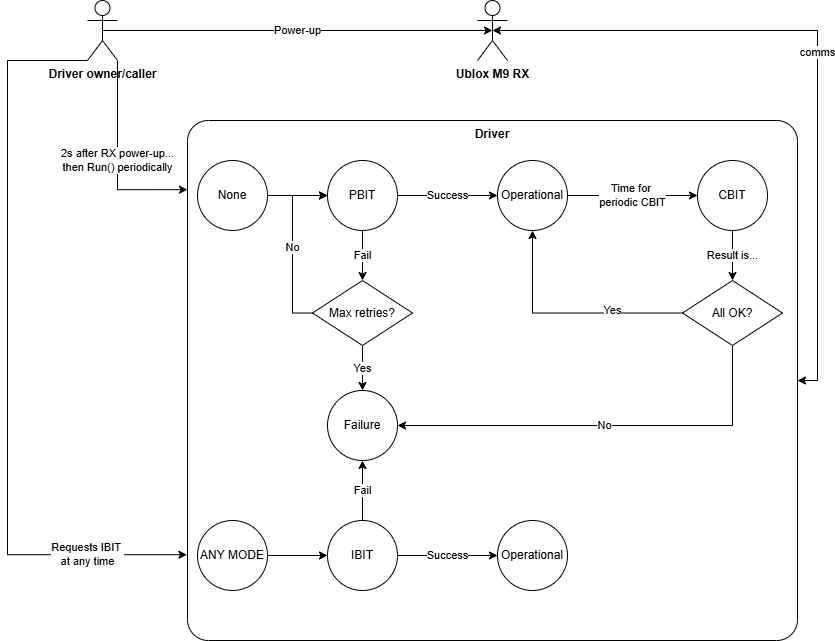
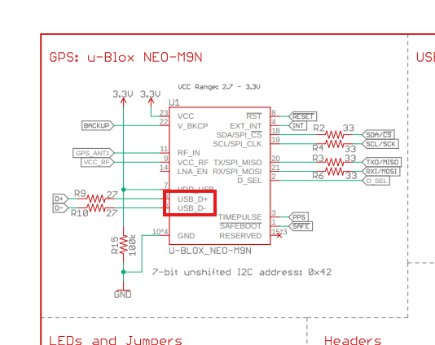

+++
title = "A driver for the Ublox M9: Development environment"
date = "2025-12-28"
description = "Article explaining the development environment of a driver project for a commercial GNSS receiver."
tags = [
    "gnss",
    "ublox",
    "receiver",
    "driver"
]
+++


## Hardware set up

As mentioned in the last post:
* Antenna positioned in the most open area possible. I live in the 3rd floor of a building so 20 cm sticking out from the window was the best I could do. This will yield quite a lot of multipath[^1] but will make do. Connect the SMA male connector of the antenna into the SMA female of the Sparkfun board.
* USB-C data-capable cable connected to the Sparkfun board.

[^1]: Multipath is the reflection of the satellite signal before reaching the receiver (bouncing through the building walls in this case), thus arrival times larger than an actual line of sight would.

## Software set up

Being Python the programming language of choice, create a virtual environment to avoid polluting the base installation. You may use `pip`, but I used `conda` like so:

```console
conda create --name myEnvName python=3.11
conda activate myEnvName
```

Then proceed to install the only third-party dependency of this project, `pyserial`, which will abstract and encapsulate all serial port functionality and be OS-independent.

```console
conda install -c conda-forge pyserial
```

If it's your first time hearing about `pyserial` I first recommend playing with its main methods, and perhaps reading some traces like the NMEA messages the receiver outputs by default.

From this point on it is assumed some knowledge of the built-in and third-party libraries that I will be mentioning. This will take the shape more of a "look how I did it" than a tutorial.

You can see the code in the Github repo [here](https://github.com/PittyPaladin/ubloxTalker).

### Some notes on the Interface Document

The [Interface Document](https://www.u-blox.com/sites/default/files/u-blox-M9-SPG-4.04_InterfaceDescription_UBX-21022436.pdf) defines two ways to receive data from an Ublox receiver: via NMEA and via UBX messages. They are two different types of protocols. The former is used since configuration requires UBX anyway. For details on the UBX protocol take a look at §3 of the Interface Document.

When looking at the ways to configure the receiver, one would typically look at the messages under the "UBX-CFG (0x06)" section. However, they come with a warning:

> This message is deprecated in protocol versions greater than 23.01. Use UBX-CFG-VALSET, UBX-CFGVALGET, UBX-CFG-VALDEL instead. See the Legacy UBX Message Fields Reference for the corresponding configuration item.

In other words, if you want some future-proofness to your code, use the new configuration interface from §5. Without going into much detail, since it's already in the document, the new interface gives you a key/value pair for each configurable item in existence. This way, one can stack up all configuration key/value pairs in the same message and send it in one go.

## Let's go

### Scope

You can make things as complicated as you want. That applies particularly to GNSS receiver drivers: simple communication parsing NMEA messages and using the default configuration is very easy to do. If you want a more robust driver that handles several operational modes, handles faults and acts upon them, in addition to apply your application-specific config, then that's another story. The scope of the project I'm presenting to you is this second type. As the reader will see, the driver is also oriented towards energy saving.

The capabilities for the M9 GNSS driver are the following:

1. Full operational modes
   1. Powerup Built-In Test (**PBIT**): battery of tests that run when starting up the driver[^2]. Also loads the receiver with application-specific configuration.
   2. Continuous Built-In Test (**CBIT**): launched automatically every X seconds from the first time an **Operational** mode occurs. They interrupt the normal operational mode to do some quick checks to assert the system is running well, and proceed to correct those that can be corrected and resume **Operational**, or to **Failure** if they can't.
   3. Initiated Built-In Test (**IBIT**): BIT mode initiated by the driver instance owner (can only be called upstream). Designed to force a hard reset and a do-over of the **PBIT** mode when, for some unknown reason, the driver is not performing as expected.
   4. Operational Mode (**Operational**): normal operational mode in which the driver does its main functions, like provide positioning, geofencing, etc. This state may transition to **Failure** or **CBIT** by itself, or to **IBIT** if asked by the driver instance owner.
   5. Failure Mode (**Failure**): no-return mode that captures the activities of the main `Run` method. If the driver ends up being integrated in a real receiver, this mode could alert upstream of the failure and the caller perhaps invoke an IBIT.
2. Communication with the receiver using the UBX protocol only.
3. Configuration of the receiver using the new interface defined in §5 of the [Interface Document](https://www.u-blox.com/sites/default/files/u-blox-M9-SPG-4.04_InterfaceDescription_UBX-21022436.pdf).



[^2]: The caller program (the one upstream the GNSS driver) does not control power shutdown to the receiver. In a real deployment it should. After powering up the receiver it should wait a few seconds for it to wake up and then go to PBIT mode by calling the main `Run` method.

### Scaffolding

I'm using an object oriented approach. There's a `GNSSDriver` class that encapsulates all attributes it may have and provides all the public methods needed to use it. In Python there's no such thing as "public" and "private" methods/attributes as in C++. Everything is public. Still, I like to make the differentiation in the comments (some people add underscores to indicate it) with:

```python
# Public member functions
# ---------------------------------------------
```

and

```python
# Private member functions
# ---------------------------------------------
```

In addition to that, even though it's not needed by the language, I mimic C++ in the sense that all attributes used anywhere in the class are declared beforehand in the `__init__` method. This way, all attributes that could exist are easily identifiable and default initialized in one same place. They are all treated as private, in the sense that obtaining them should require a getter or a setter to modify their value.

#### Class attributes

Rather than copy pasting the typical UML class diagram for `GNSSDriver`, it makes more sense to explain the class attributes as groups, and elaborate on the purpose of each group. Going into the specific thing a variable does in that group overcomplicates the explanation. Besides, for sure you would do it differently (better).

Block of class attributes used for:

1. **USB connectivity-related variables**.
2. **Circular buffer**: for RX message reception. Messages are taken from a receive queue[^3] and input into a message buffer, ready to be processed.
3. **Pending commands**: all commands for which the driver could ask something from the RX. They are marked "pending" until the response actually comes.
4. **RX internal data**: internal data we know from the RX, each variable updated in a different operational mode in no particular order. But at least all RX info is packed here.
5. **Analytics**: for tracking count of checksum errors and worst case execution times.
6. **Driver's Finite State Machine (FSM)**: self-explanatory.
7. **The Config Handler**: internal data of the piece of code in charge of reading, checking and updating RX configuration as desired. It's complicated and will have its [own blog entry]().
8. **Internal variables for BIT**: I will explain it later, but the BIT (Built-In Test) is a set of checks that IBIT, PBIT and IBIT have in common. It is not a mode in of itself.
9. **Internal variables for PBIT**: also includes the "ascfg", or *Application-Specific Config*, which is a dictionary with all configuration values that differ from the defaults declared in the ICD and need to be configured into the RX.
10. **Internal variables for CBIT**: also includes the "defcfg", or *Default Config*, which is a dictionary with *all* configuration values (minus application-specific) declared in the ICD and the default value they should be having in memory. Used to check no external entity changed them.
11. **Internal variables for IBIT**.
12. **Internal variables for Operational mode**.

[^3]: Just like (actually mimicking) a queue filled by a DMA peripheral, in order to avoid processing messages by interruption. This was actually the approach used with the STM32 prior to pivoting into PC+USB+Python. Due to the slow rate messaging, interruption could have worked fine, but since DMA is present, why not use it?


#### Class methods intended to be public
1. `connect()`: opens serial communication using pyserial at a baud rate of 38400, but any value will do. There's no UART behind the USB connector in the Sparkfun board, but rather a pinout from the actual USB pins on the M9 chip. So baudrate doesn't apply as it would if we were to pin the UART1 to a UART-to-USB converter. Just choose the right COM interface depending on where you plugged the USB on your PC.
Note that this function will place the `_read_loop()` method in a separate thread. It will solely be in charge of placing the incoming data from the USB **in a ring buffer for the main application to consume it**.



2. `is_connected()`: to assert that the next iteration of the infinite loop can be run by checking that the connection is up.
3. `disconnect()`: join threads and close connection.
4. `Run()`: main application function. In this order, it handles:
    1. **Priority commands** that take precedence on the actions that the current operational mode require.
    2. **Actions of current mode**.
    3. **Consume data from the ring buffer** in which the `_read_loop()` function, running in a separate thread, is placing the messages. This includes parsing the message and storing its information in the internal class attributes.


If the reader takes a look at the code, he will see that there are some other public methods that can be launched depending on user input via the same terminal the program is running. Those are:
1. `launch_ibit()`: mentioned above, the IBIT is called by the instance owner of the class. That's you, at your discretion. Typing "ibit" in upper or lowercase wil trigger it.
2. `activate_geofence()` and `deactivate_geofence()`: this is still a work in progress, but it's intended to set up a perimeter surrounding the location of the beacon (which will be static mostly) and alert when it exits said perimeter, because of a theft for instance.

Next blog entry will dive deeper in the meat of the matter: the `Run()` function.
