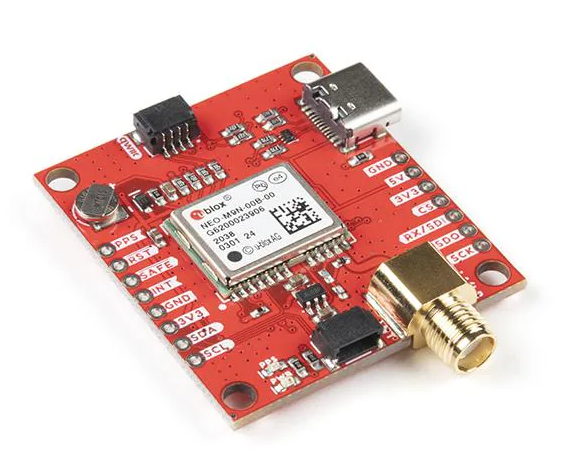

+++
title = "A driver for the Ublox M9: Introduction"
date = "2025-12-27"
description = "Article introducing my driver project with a commercial GNSS receiver."
tags = [
    "gnss",
    "ublox",
    "receiver",
    "driver"
]
+++

## Motivation
Even though I love my profession and quite like where I work, I (as many others) have always desired to create and own a product from scratch rather than be a piece of the Adam Smiths's division of labour (not criticizing that, we would go to the stone age otherwise). Something small and simple enough that 1 or 2 persons can manage it, but still advanced enough to add value to users and fulfill a necessity where other products haven't.

One day, in a coffee break, some colleagues and I were talking about this idea where beacons are implanted in the middle of crops to send soil quality telemetry to a central server. We researched the idea and found that a company already does that, [CropX](https://cropx.com/es/cropx-system/hardware/). I was looking for a project to do in my spare time, and thought that a cheapo version of it could be fun, specially if adding those sensors that I always wanted to play with but never had the excuse. I also thought that this project was ideal to team up with my friend [Daniel Béjar](https://github.com/dabecart), with whom I wanted to work together for months.

So, with that in mind, we sat down and wrote the requirements our soil sensor would. I will not bore you with the technicalities, suffice to say that in broad terms we wanted it to have:
1. An NPK soil sensor.
2. A plastic housing that is a Commercial Off The Shelve (COTS) with minor modifications.
3. A battery, a recharging management system and a solar panel to recharge said battery.
4. A GPS receiver (GNSS is the actual term, since multiple constellations will be used) for easy sensor location.
5. A LoRaWAN emitter and receiver, capable to emit and receive telemetry, and forward other sensor's telemetry to reach a final endpoint.
6. Some kind of microcontroller to orchestrate it all.

It seemed something doable at the beginning, but wishful thinking caught us off guard. Again. There's no way 2 adults with a 9 to 5 job can do any of that in any sensible measure of time. Not even the programming, and that's without counting the PCB design, the mechanical design, and a fair amount of testing. So we decided to pick a "subsystem" from the one listed, the one we liked the most, and see how far we could go exploring the topic. That would be fun.

And it indeed was. I have decided to write this series of posts explaining my journey.

Daniel picked the LoRaWAN receiver/emitter. He plans to write a blog about his very interesting discoveries, full link when it's ready. I picked the GNSS receiver.

## The Ublox NEO-M9N

I had past work experience with high-end GNSS receivers from [Septentrio](https://www.septentrio.com/en), the [MosaicX5](https://www.septentrio.com/en/products/gnss-receivers/gnss-receiver-modules/mosaic-x5-devkit) in particular, and I always wanted to explore the products of its main competitor, [Ublox](https://www.u-blox.com/en). Not only that, but see how well a ~40€ low-end standard receiver would fare (as of today MosaicX5 are ~700€ and high-end Ublox F10 are ~250€, outside my budget). I started searching the wide range of low-cost positioning products Ublox has, and settled for the NEO-M9N. Mainly because of the fact that Sparkfun has made a decently priced [breakout board](https://www.sparkfun.com/sparkfun-gps-breakout-neo-m9n-sma-qwiic.html) for $70, thus liberating me from buying Ublox's expensive development kit and still having a ready-to-use SMA connection for the antenna and a USB-C to interface with the chip.

 # FIXME

I'm going to be honest: I bought the NEO-M9N because it was the cheapest standard precision receiver that Sparkfun had in store with a plug-and-play USB-C. For a battery operated system the ultra-low power M10S would have ben a better option. I just wanted to get started talking to the receiver and figuring how it works. Which brings me to its Interface Control Document (ICD) and Graphical User Interface (GUI).

The ICD, called Interface Manual by Ublox, is common for all M9 series (independent of the enclosure, which is the "NEO" part) and is the [u-blox M9 SPG 4.04](https://www.u-blox.com/sites/default/files/u-blox-M9-SPG-4.04_InterfaceDescription_UBX-21022436.pdf). In addition to the Interface Manual there's an [Integration Manual](https://www.u-blox.com/sites/default/files/NEO-M9N_Integrationmanual_UBX-19014286.pdf) and a [Datasheet](https://content.u-blox.com/sites/default/files/NEO-M9N-00B_DataSheet_UBX-19014285.pdf). The latter talks about performance, electrical, mechanical and pinout stuff, and is not relevant for writing a driver with a pre-made breakout board like the Sparkfun one.

The GUI is called [u-center](https://content.u-blox.com/sites/default/files/u-center_Userguide_UBX-13005250.pdf). Despite its appearence, it's an amazing piece of software. If you are getting started into the world of GNSS it will allow you to understand the basic concepts and what a serious receiver is able to do. For more advanced users, it's a productivity boost to test out configurations and write programs interfacing with it (drivers).

In addition to the M9 from Sparkfun I also bought a very cheap antenna on Mouser, the [ANT-GPSC-SMA from RF Solutions](https://www.mouser.es/ProductDetail/223-ANT-GPSC-SMA). It has worked well enough for me provided you are not in the middle of a urban canyon.

## Starting point

The products have arrived by mail. Now what? First, to make sure that the breakout board works. Plugging antenna, USB-C to a PC with u-center installed, and choosing the right COM is all that is needed. Channels go into tracking and a PVT (Position, Velocity and Time, the actual navigation solution) is output. All is ok.

The next question is: who do you want it to communicate with? As per the project intent, it should be able to communicate with a low power MicroController Unit (MCU). At the end of the day, all "heavy-lifting" is done by the sensors. The MCU will only ask them for outputs, do some basic logic with said output, and perhaps feed the sensors some input. On my end, at its most basic stage, the MCU should have the driver to (1) obtain a PVT solution from the M9, (2) repackage it to its most basic form, and (3) give that data to the LoRaWAN driver, which is on Daniel's end. He will, in turn, send that data to the LoRaWAN emitter, which will send the message over the air to whomever is listening.

There are many MCU providers in the market. Daniel recommended an STM32, which was perfect since I already had one lying around. I connected the jumping wires to the UART1, set up the environment and started coding.

I could go on explaining the ins and outs, but it would be useless: as development of the driver got more complicated, I decided to ditch the C approach on the STM32 and switch to Python running straight on my PC. The idea is: first write a very robust code in Python, with all the intricacies I feel are needed on a sensor as complex as a GNSS receiver, validate all functionality, and then go and port that to C.

At the time of writing this post, with the Python driver nearing completion, I can confirm that this was the right decision. Regardless of the programming language or architecture the driver runs on, a thorough analysis of the Interface Manual and a proper software architecture are required. This will be the subject of the upcoming posts.
