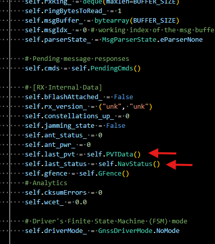

+++
title = "A driver for the Ublox M9: Operational mode"
date = "2026-03-03"
description = "Article explaining the different working modes. In this specific case, the Operational Mode."
tags = [
    "gnss",
    "ublox",
    "receiver",
    "driver"
]
+++


## The Operational mode
At last, the Operational mode. I have dedicated so much time to the rest of the modes that Operational mode has end up being quite simple. It shall handle geofencing, if activated (work in progress) and that's all. Here you have ample room to expand the functionality depending on your needs, like:

* Doing some consistency checks on the PVT output.
* Filling a queue so that the driver's caller (the MCU for instance) has the latest info on positioning, perhaps to forward it via LoraWAN.

At the beginning of writing the Operational mode, I polled PVT messages manually. But I changed it to just letting the Ublox give me the PVTs at his own pace and storing them in an internal data structure, in here:



It's easier this way. Setting up the PVT periodicity can be done with:

```python
    0x20d00001: {
        "name": "CFG-PM-OPERATEMODE",
        "type": "E1",
        "expectedVal": 1, # PSM ON/OFF operation (PSMOO)
        "actualVal": CFG_VAL_UNKNOWN
    },
    0x40d00002: {
        "name": "CFG-PM-POSUPDATEPERIOD",
        "type": "U4",
        "expectedVal": 60, # seconds
        "actualVal": CFG_VAL_UNKNOWN
    },
```

Operational mode will only transition to CBIT after X seconds. That periodicity is something you can control and adapt to what makes sense to you. But bear in mind that if you plan to switch off the receiver's power in between runs to save battery, it shall be significantly smaller than that, otherwise CBIT won't run at all or will never check all config items.

Operational mode will also alert if PVT or Nav status messages (UBX-NAV-PVT and UBX-NAV-STATUS respectively) stop arriving.

## Sample run

Below you can see the output of a sample run, with the lowest level debug prints activated. Allow me to explain them:

1. To provoke a configuration from a factory state, I invoke an IBIT by typing `ibit`in the console just as the receiver starts. So, it starts with a regular PBIT and its steps, but I stop it with an `ibit`, which effectively starts when you see at line 68 `[INFO] [GNSSDriver] IBIT > Launching NOW`.

2. IBIT resets the receiver, runs a BIT, and launches `cfg_ctrl` to apply the application-specific configuration. You can  see its submodes:

    2.1. All lines that start with `VALGET parser says: KeyId 0x...` belong to the VALGET submode, where the driver asks to the receiver what its actual configuration is (that's the `CFG CTRL > Sending VALGET for 56/56 cfg items`) and gets a response.
    2.2. `cfg_ctrl` goes into VALSET submode. After receiving the UBX-CFG-VALGET, all items that do not have the desired config are put into a UBX-CFG-VALSET with the required value they need to have. That is done in the `CFG CTRL > Sending VALGET for 56/56 cfg items` line.
    2.3. After receiving the ACK for the UBX-CFG-VALSET, `cfg_ctrl` goes back to VALGET submode to send a final UBX-CFG-VALGET to check that the configuration has indeed been set. That's why you see the lines `VALGET parser says: KeyId 0x...` again. Note: you may have noticed some prints regarding PVT data. That is due to the periodicity of the PVT message at that point in time. You could poll for the PVT message, but I think it's just easier to set it at a fixed rate. So, when it arrives it is stored in internal structs and printed to screen (what you do with that data is up to you in the Operational mode).That's why you see it there in the middle out of nowhere.
    2.4. After all these `VALGET parser says: KeyId 0x...`, you will see a `[DEBUG] [GNSSDriver] CFG CTRL > VALSET not needed, all cfg values set!`. That means the config was properly set, and the second VALGET returned config items matching the ones put with the VALSET.
    2.5. Being the last procedure `cfg_ctrl` a success, the whole IBIT is declared as successful, it can be seen on line 229 with `[INFO] [GNSSDriver] IBIT > SUCCESS. Going to Operational Mode!`.

3. As you can see, PVT Data messages keep being sent by the receiver, and printed to screen as they arrive. But not at the rate of 60 seconds we set with "CFG-PM-POSUPDATEPERIOD". It seems that the configuration takes some time to apply. It's not until line 275 that one can observe time stamps separated by deltas of 60 seconds. Note that it's not actually one single message every 60 seconds, but a window of messages being output during a couple of seconds, every 60 seconds.


```bash
[DEBUG] [GNSSDriver] Connected to COM6 at 38400 baud.
[INFO] [GNSSDriver] PBIT: Launching NOW
[DEBUG] [GNSSDriver] ACK for 0x6 0x9
[DEBUG] [GNSSDriver] MON-VER parsed: swVersion='EXT CORE 4.04 (7f89f7)\x00\x00\x00\x00\x00\x00\x00\x00', hwVersion='00190000\x00\x00', protver=32.01, spg=4.04
[INFO] [GNSSDriver] Flash device detected with 345600 bytes
[DEBUG] [GNSSDriver] UBX-MON-GNSS returns > supported: 00001111 | defaultGnss: 00001111 | enabled: 00001111 | simultaneous: 4
[DEBUG] [GNSSDriver] UBX-MON-RF returns > JAM STATE: 0 | ANT_STATUS: 0 | ANT_PWR: 0
[DEBUG] [GNSSDriver] CFG CTRL > Sending VALGET for 56/56 cfg items
ibit
[DEBUG] [GNSSDriver] VALGET parser says: KeyId 0x10230001 = False
[DEBUG] [GNSSDriver] VALGET parser says: KeyId 0x10510003 = True
[DEBUG] [GNSSDriver] VALGET parser says: KeyId 0x20920001 = 0
[DEBUG] [GNSSDriver] VALGET parser says: KeyId 0x20920002 = 3
[DEBUG] [GNSSDriver] VALGET parser says: KeyId 0x20920003 = 0
[DEBUG] [GNSSDriver] VALGET parser says: KeyId 0x20920005 = 0
[DEBUG] [GNSSDriver] VALGET parser says: KeyId 0x20920006 = 0
[DEBUG] [GNSSDriver] VALGET parser says: KeyId 0x20920007 = 0
[DEBUG] [GNSSDriver] VALGET parser says: KeyId 0x20920008 = 0
[DEBUG] [GNSSDriver] VALGET parser says: KeyId 0x20920009 = 0
[DEBUG] [GNSSDriver] VALGET parser says: KeyId 0x2092000a = 0
[DEBUG] [GNSSDriver] VALGET parser says: KeyId 0x209100ba = 0
[DEBUG] [GNSSDriver] VALGET parser says: KeyId 0x209100be = 0
[DEBUG] [GNSSDriver] VALGET parser says: KeyId 0x209100bb = 0
[DEBUG] [GNSSDriver] VALGET parser says: KeyId 0x209100bc = 0
[DEBUG] [GNSSDriver] VALGET parser says: KeyId 0x209100bd = 0
[DEBUG] [GNSSDriver] VALGET parser says: KeyId 0x209100c9 = 0
[DEBUG] [GNSSDriver] VALGET parser says: KeyId 0x209100cd = 0
[DEBUG] [GNSSDriver] VALGET parser says: KeyId 0x209100ca = 0
[DEBUG] [GNSSDriver] VALGET parser says: KeyId 0x209100cb = 0
[DEBUG] [GNSSDriver] VALGET parser says: KeyId 0x209100cc = 0
[DEBUG] [GNSSDriver] VALGET parser says: KeyId 0x209100bf = 0
[DEBUG] [GNSSDriver] VALGET parser says: KeyId 0x209100c3 = 0
[DEBUG] [GNSSDriver] VALGET parser says: KeyId 0x209100c0 = 0
[DEBUG] [GNSSDriver] VALGET parser says: KeyId 0x209100c1 = 0
[DEBUG] [GNSSDriver] VALGET parser says: KeyId 0x209100c2 = 0
[DEBUG] [GNSSDriver] VALGET parser says: KeyId 0x209100c4 = 0
[DEBUG] [GNSSDriver] VALGET parser says: KeyId 0x209100c8 = 0
[DEBUG] [GNSSDriver] VALGET parser says: KeyId 0x209100c5 = 0
[DEBUG] [GNSSDriver] VALGET parser says: KeyId 0x209100c6 = 0
[DEBUG] [GNSSDriver] VALGET parser says: KeyId 0x209100c7 = 0
[DEBUG] [GNSSDriver] VALGET parser says: KeyId 0x209100ab = 0
[DEBUG] [GNSSDriver] VALGET parser says: KeyId 0x209100af = 0
[DEBUG] [GNSSDriver] VALGET parser says: KeyId 0x209100ac = 0
[DEBUG] [GNSSDriver] VALGET parser says: KeyId 0x209100ad = 0
[DEBUG] [GNSSDriver] VALGET parser says: KeyId 0x209100ae = 0
[DEBUG] [GNSSDriver] VALGET parser says: KeyId 0x209100b0 = 0
[DEBUG] [GNSSDriver] VALGET parser says: KeyId 0x209100b4 = 0
[DEBUG] [GNSSDriver] VALGET parser says: KeyId 0x209100b1 = 0
[DEBUG] [GNSSDriver] VALGET parser says: KeyId 0x209100b2 = 0
[DEBUG] [GNSSDriver] VALGET parser says: KeyId 0x209100b3 = 0
[DEBUG] [GNSSDriver] VALGET parser says: KeyId 0x20910009 = 1
[DEBUG] [GNSSDriver] VALGET parser says: KeyId 0x2091001d = 1
[DEBUG] [GNSSDriver] VALGET parser says: KeyId 0x10110019 = False
[DEBUG] [GNSSDriver] VALGET parser says: KeyId 0x20110021 = 2
[DEBUG] [GNSSDriver] VALGET parser says: KeyId 0x20d00001 = 1
[DEBUG] [GNSSDriver] VALGET parser says: KeyId 0x40d00002 = 60
[DEBUG] [GNSSDriver] VALGET parser says: KeyId 0x10370005 = False
[DEBUG] [GNSSDriver] VALGET parser says: KeyId 0x10360003 = False
[DEBUG] [GNSSDriver] VALGET parser says: KeyId 0x10360004 = False
[DEBUG] [GNSSDriver] VALGET parser says: KeyId 0x10310020 = False
[DEBUG] [GNSSDriver] VALGET parser says: KeyId 0x10310005 = False
[DEBUG] [GNSSDriver] VALGET parser says: KeyId 0x10730001 = False
[DEBUG] [GNSSDriver] VALGET parser says: KeyId 0x10730004 = False
[DEBUG] [GNSSDriver] VALGET parser says: KeyId 0x10740002 = False
[DEBUG] [GNSSDriver] VALGET parser says: KeyId 0x10530005 = False
[DEBUG] [GNSSDriver] CFG-VALGET parsed: payloadLen=287, version=1, layer=0, position=0
[DEBUG] [GNSSDriver] ACK for 0x6 0x8b
[INFO] [GNSSDriver] IBIT > Launching NOW
[DEBUG] [GNSSDriver] IBIT > Clearing all cfg in flash and BBR
[DEBUG] [GNSSDriver] ACK for 0x6 0x9
[DEBUG] [GNSSDriver] IBIT > Sending RST
[DEBUG] [GNSSDriver] Connected to COM6 at 38400 baud.
[DEBUG] [GNSSDriver] UBX-MON-RF returns > JAM STATE: 0 | ANT_STATUS: 2 | ANT_PWR: 1
[DEBUG] [GNSSDriver] CFG CTRL > Sending VALGET for 56/56 cfg items
[DEBUG] [GNSSDriver] VALGET parser says: KeyId 0x10230001 = True
[DEBUG] [GNSSDriver] VALGET parser says: KeyId 0x10510003 = True
[DEBUG] [GNSSDriver] VALGET parser says: KeyId 0x20920001 = 0
[DEBUG] [GNSSDriver] VALGET parser says: KeyId 0x20920002 = 0
[DEBUG] [GNSSDriver] VALGET parser says: KeyId 0x20920003 = 0
[DEBUG] [GNSSDriver] VALGET parser says: KeyId 0x20920005 = 0
[DEBUG] [GNSSDriver] VALGET parser says: KeyId 0x20920006 = 7
[DEBUG] [GNSSDriver] VALGET parser says: KeyId 0x20920007 = 7
[DEBUG] [GNSSDriver] VALGET parser says: KeyId 0x20920008 = 7
[DEBUG] [GNSSDriver] VALGET parser says: KeyId 0x20920009 = 7
[DEBUG] [GNSSDriver] VALGET parser says: KeyId 0x2092000a = 7
[DEBUG] [GNSSDriver] VALGET parser says: KeyId 0x209100ba = 1
[DEBUG] [GNSSDriver] VALGET parser says: KeyId 0x209100be = 1
[DEBUG] [GNSSDriver] VALGET parser says: KeyId 0x209100bb = 1
[DEBUG] [GNSSDriver] VALGET parser says: KeyId 0x209100bc = 1
[DEBUG] [GNSSDriver] VALGET parser says: KeyId 0x209100bd = 1
[DEBUG] [GNSSDriver] VALGET parser says: KeyId 0x209100c9 = 1
[DEBUG] [GNSSDriver] VALGET parser says: KeyId 0x209100cd = 1
[DEBUG] [GNSSDriver] VALGET parser says: KeyId 0x209100ca = 1
[DEBUG] [GNSSDriver] VALGET parser says: KeyId 0x209100cb = 1
[DEBUG] [GNSSDriver] VALGET parser says: KeyId 0x209100cc = 1
[DEBUG] [GNSSDriver] VALGET parser says: KeyId 0x209100bf = 1
[DEBUG] [GNSSDriver] VALGET parser says: KeyId 0x209100c3 = 1
[DEBUG] [GNSSDriver] VALGET parser says: KeyId 0x209100c0 = 1
[DEBUG] [GNSSDriver] VALGET parser says: KeyId 0x209100c1 = 1
[DEBUG] [GNSSDriver] VALGET parser says: KeyId 0x209100c2 = 1
[DEBUG] [GNSSDriver] VALGET parser says: KeyId 0x209100c4 = 1
[DEBUG] [GNSSDriver] VALGET parser says: KeyId 0x209100c8 = 1
[DEBUG] [GNSSDriver] VALGET parser says: KeyId 0x209100c5 = 1
[DEBUG] [GNSSDriver] VALGET parser says: KeyId 0x209100c6 = 1
[DEBUG] [GNSSDriver] VALGET parser says: KeyId 0x209100c7 = 1
[DEBUG] [GNSSDriver] VALGET parser says: KeyId 0x209100ab = 1
[DEBUG] [GNSSDriver] VALGET parser says: KeyId 0x209100af = 1
[DEBUG] [GNSSDriver] VALGET parser says: KeyId 0x209100ac = 1
[DEBUG] [GNSSDriver] VALGET parser says: KeyId 0x209100ad = 1
[DEBUG] [GNSSDriver] VALGET parser says: KeyId 0x209100ae = 1
[DEBUG] [GNSSDriver] VALGET parser says: KeyId 0x209100b0 = 1
[DEBUG] [GNSSDriver] VALGET parser says: KeyId 0x209100b4 = 1
[DEBUG] [GNSSDriver] VALGET parser says: KeyId 0x209100b1 = 1
[DEBUG] [GNSSDriver] VALGET parser says: KeyId 0x209100b2 = 1
[DEBUG] [GNSSDriver] VALGET parser says: KeyId 0x209100b3 = 1
[DEBUG] [GNSSDriver] VALGET parser says: KeyId 0x20910009 = 0
[DEBUG] [GNSSDriver] VALGET parser says: KeyId 0x2091001d = 0
[DEBUG] [GNSSDriver] VALGET parser says: KeyId 0x10110019 = False
[DEBUG] [GNSSDriver] VALGET parser says: KeyId 0x20110021 = 0
[DEBUG] [GNSSDriver] VALGET parser says: KeyId 0x20d00001 = 0
[DEBUG] [GNSSDriver] VALGET parser says: KeyId 0x40d00002 = 10
[DEBUG] [GNSSDriver] VALGET parser says: KeyId 0x10370005 = True
[DEBUG] [GNSSDriver] VALGET parser says: KeyId 0x10360003 = True
[DEBUG] [GNSSDriver] VALGET parser says: KeyId 0x10360004 = True
[DEBUG] [GNSSDriver] VALGET parser says: KeyId 0x10310020 = True
[DEBUG] [GNSSDriver] VALGET parser says: KeyId 0x10310005 = True
[DEBUG] [GNSSDriver] VALGET parser says: KeyId 0x10730001 = True
[DEBUG] [GNSSDriver] VALGET parser says: KeyId 0x10730004 = True
[DEBUG] [GNSSDriver] VALGET parser says: KeyId 0x10740002 = True
[DEBUG] [GNSSDriver] VALGET parser says: KeyId 0x10530005 = True
[DEBUG] [GNSSDriver] CFG-VALGET parsed: payloadLen=287, version=1, layer=0, position=0
[DEBUG] [GNSSDriver] ACK for 0x6 0x8b
[DEBUG] [GNSSDriver] CFG CTRL > Sending CFG-VALSET command for 51 cfg items for layer=0
[DEBUG] [GNSSDriver] ACK for 0x6 0x8a
[DEBUG] [GNSSDriver] GNSSDriver.PVTData(tstamp=4841.812, numSV=0, lon=0.0, lat=0.0, height=0.0, heightMSL=-17.0)
[DEBUG] [GNSSDriver] GNSSDriver.PVTData(tstamp=4841.812, numSV=0, lon=0.0, lat=0.0, height=0.0, heightMSL=-17.0)
[DEBUG] [GNSSDriver] GNSSDriver.PVTData(tstamp=4841.812, numSV=0, lon=0.0, lat=0.0, height=0.0, heightMSL=-17.0)
[DEBUG] [GNSSDriver] GNSSDriver.PVTData(tstamp=4841.812, numSV=0, lon=0.0, lat=0.0, height=0.0, heightMSL=-17.0)
[DEBUG] [GNSSDriver] GNSSDriver.PVTData(tstamp=4841.812, numSV=0, lon=0.0, lat=0.0, height=0.0, heightMSL=-17.0)
[DEBUG] [GNSSDriver] GNSSDriver.PVTData(tstamp=4841.812, numSV=0, lon=0.0, lat=0.0, height=0.0, heightMSL=-17.0)
[DEBUG] [GNSSDriver] GNSSDriver.PVTData(tstamp=4841.812, numSV=0, lon=0.0, lat=0.0, height=0.0, heightMSL=-17.0)
[ERROR] [GNSSDriver] Non-matching CRCs for UBX message ['0x1', '0x7', '0x5c', '0x0', '0xa0', '0xf', '0x0', '0x0', '0xe4', '0x7', '0x8', '0x2', '0x0', '0x0', '0x4', '0xf0', '0xff', '0xff', '0xff', '0xff', '0xb4', '0x0', '0x0', '0x0', '0x0', '0x8', '0x24', '0x0', '0x0', '0x0', '0x0', '0x0', '0x0', '0x0', '0x0', '0x0', '0x0', '0x0', '0x0', '0x0', '0x98', '0xbd', '0xff', '0xff', '0xff', '0xff', '0xff', '0xff', '0x0', '0x76', '0x84', '0xdf', '0x0', '0x0', '0x0', '0x0', '0x0', '0x0', '0x0', '0x0', '0x0', '0x0', '0x0', '0x0', '0x0', '0x0', '0x0', '0x0', '0x0', '0x0', '0x0', '0x0', '0xa', '0xbd', '0xff', '0xff', '0xff', '0xff', '0xff', '0xff', '0x0', '0x76', '0x84', '0xdf', '0x0', '0x0', '0x0', '0x0', '0x0', '0x0', '0x0', '0x0', '0x0', '0x0', '0x0', '0x0']
[DEBUG] [GNSSDriver] GNSSDriver.PVTData(tstamp=4852.687, numSV=0, lon=0.0, lat=0.0, height=0.0, heightMSL=-17.0)
[DEBUG] [GNSSDriver] GNSSDriver.PVTData(tstamp=4852.687, numSV=0, lon=0.0, lat=0.0, height=0.0, heightMSL=-17.0)
[DEBUG] [GNSSDriver] GNSSDriver.PVTData(tstamp=4852.687, numSV=0, lon=0.0, lat=0.0, height=0.0, heightMSL=-17.0)
[DEBUG] [GNSSDriver] GNSSDriver.PVTData(tstamp=4852.687, numSV=0, lon=0.0, lat=0.0, height=0.0, heightMSL=-17.0)
[DEBUG] [GNSSDriver] GNSSDriver.PVTData(tstamp=4852.687, numSV=0, lon=0.0, lat=0.0, height=0.0, heightMSL=-17.0)
[DEBUG] [GNSSDriver] GNSSDriver.PVTData(tstamp=4852.687, numSV=0, lon=0.0, lat=0.0, height=0.0, heightMSL=-17.0)
[DEBUG] [GNSSDriver] GNSSDriver.PVTData(tstamp=4852.687, numSV=0, lon=0.0, lat=0.0, height=0.0, heightMSL=-17.0)
[DEBUG] [GNSSDriver] CFG CTRL > Sending CFG-VALSET command for 51 cfg items for layer=2
[DEBUG] [GNSSDriver] GNSSDriver.PVTData(tstamp=4854.703, numSV=0, lon=0.0, lat=0.0, height=0.0, heightMSL=-17.0)
[DEBUG] [GNSSDriver] ACK for 0x6 0x8a
[DEBUG] [GNSSDriver] GNSSDriver.PVTData(tstamp=4854.703, numSV=0, lon=0.0, lat=0.0, height=0.0, heightMSL=-17.0)
[DEBUG] [GNSSDriver] GNSSDriver.PVTData(tstamp=4854.703, numSV=0, lon=0.0, lat=0.0, height=0.0, heightMSL=-17.0)
[DEBUG] [GNSSDriver] GNSSDriver.PVTData(tstamp=4854.703, numSV=0, lon=0.0, lat=0.0, height=0.0, heightMSL=-17.0)
[DEBUG] [GNSSDriver] GNSSDriver.PVTData(tstamp=4857.031, numSV=0, lon=0.0, lat=0.0, height=0.0, heightMSL=-17.0)
[DEBUG] [GNSSDriver] GNSSDriver.PVTData(tstamp=4857.031, numSV=0, lon=0.0, lat=0.0, height=0.0, heightMSL=-17.0)
[DEBUG] [GNSSDriver] GNSSDriver.PVTData(tstamp=4857.031, numSV=0, lon=0.0, lat=0.0, height=0.0, heightMSL=-17.0)
[DEBUG] [GNSSDriver] GNSSDriver.PVTData(tstamp=4857.031, numSV=0, lon=0.0, lat=0.0, height=0.0, heightMSL=-17.0)
[DEBUG] [GNSSDriver] GNSSDriver.PVTData(tstamp=4857.031, numSV=0, lon=0.0, lat=0.0, height=0.0, heightMSL=-17.0)
[DEBUG] [GNSSDriver] CFG CTRL > Sending VALGET for 56/56 cfg items
[DEBUG] [GNSSDriver] GNSSDriver.PVTData(tstamp=4857.687, numSV=0, lon=0.0, lat=0.0, height=0.0, heightMSL=-17.0)
[DEBUG] [GNSSDriver] VALGET parser says: KeyId 0x10230001 = False
[DEBUG] [GNSSDriver] VALGET parser says: KeyId 0x20920002 = 3
[DEBUG] [GNSSDriver] VALGET parser says: KeyId 0x20920006 = 0
[DEBUG] [GNSSDriver] VALGET parser says: KeyId 0x20920007 = 0
[DEBUG] [GNSSDriver] VALGET parser says: KeyId 0x20920008 = 0
[DEBUG] [GNSSDriver] VALGET parser says: KeyId 0x20920009 = 0
[DEBUG] [GNSSDriver] VALGET parser says: KeyId 0x2092000a = 0
[DEBUG] [GNSSDriver] VALGET parser says: KeyId 0x209100ba = 0
[DEBUG] [GNSSDriver] VALGET parser says: KeyId 0x209100be = 0
[DEBUG] [GNSSDriver] VALGET parser says: KeyId 0x209100bb = 0
[DEBUG] [GNSSDriver] VALGET parser says: KeyId 0x209100bc = 0
[DEBUG] [GNSSDriver] VALGET parser says: KeyId 0x209100bd = 0
[DEBUG] [GNSSDriver] VALGET parser says: KeyId 0x209100c9 = 0
[DEBUG] [GNSSDriver] VALGET parser says: KeyId 0x209100cd = 0
[DEBUG] [GNSSDriver] VALGET parser says: KeyId 0x209100ca = 0
[DEBUG] [GNSSDriver] VALGET parser says: KeyId 0x209100cb = 0
[DEBUG] [GNSSDriver] VALGET parser says: KeyId 0x209100cc = 0
[DEBUG] [GNSSDriver] VALGET parser says: KeyId 0x209100bf = 0
[DEBUG] [GNSSDriver] VALGET parser says: KeyId 0x209100c3 = 0
[DEBUG] [GNSSDriver] VALGET parser says: KeyId 0x209100c0 = 0
[DEBUG] [GNSSDriver] VALGET parser says: KeyId 0x209100c1 = 0
[DEBUG] [GNSSDriver] VALGET parser says: KeyId 0x209100c2 = 0
[DEBUG] [GNSSDriver] VALGET parser says: KeyId 0x209100c4 = 0
[DEBUG] [GNSSDriver] VALGET parser says: KeyId 0x209100c8 = 0
[DEBUG] [GNSSDriver] VALGET parser says: KeyId 0x209100c5 = 0
[DEBUG] [GNSSDriver] VALGET parser says: KeyId 0x209100c6 = 0
[DEBUG] [GNSSDriver] VALGET parser says: KeyId 0x209100c7 = 0
[DEBUG] [GNSSDriver] VALGET parser says: KeyId 0x209100ab = 0
[DEBUG] [GNSSDriver] VALGET parser says: KeyId 0x209100af = 0
[DEBUG] [GNSSDriver] VALGET parser says: KeyId 0x209100ac = 0
[DEBUG] [GNSSDriver] VALGET parser says: KeyId 0x209100ad = 0
[DEBUG] [GNSSDriver] VALGET parser says: KeyId 0x209100ae = 0
[DEBUG] [GNSSDriver] VALGET parser says: KeyId 0x209100b0 = 0
[DEBUG] [GNSSDriver] VALGET parser says: KeyId 0x209100b4 = 0
[DEBUG] [GNSSDriver] VALGET parser says: KeyId 0x209100b1 = 0
[DEBUG] [GNSSDriver] VALGET parser says: KeyId 0x209100b2 = 0
[DEBUG] [GNSSDriver] VALGET parser says: KeyId 0x209100b3 = 0
[DEBUG] [GNSSDriver] VALGET parser says: KeyId 0x20910009 = 1
[DEBUG] [GNSSDriver] VALGET parser says: KeyId 0x2091001d = 1
[DEBUG] [GNSSDriver] VALGET parser says: KeyId 0x20110021 = 2
[DEBUG] [GNSSDriver] VALGET parser says: KeyId 0x20d00001 = 1
[DEBUG] [GNSSDriver] VALGET parser says: KeyId 0x40d00002 = 60
[DEBUG] [GNSSDriver] VALGET parser says: KeyId 0x10370005 = False
[DEBUG] [GNSSDriver] VALGET parser says: KeyId 0x10360003 = False
[DEBUG] [GNSSDriver] VALGET parser says: KeyId 0x10360004 = False
[DEBUG] [GNSSDriver] VALGET parser says: KeyId 0x10310020 = False
[DEBUG] [GNSSDriver] VALGET parser says: KeyId 0x10310005 = False
[DEBUG] [GNSSDriver] VALGET parser says: KeyId 0x10730001 = False
[DEBUG] [GNSSDriver] VALGET parser says: KeyId 0x10730004 = False
[DEBUG] [GNSSDriver] VALGET parser says: KeyId 0x10740002 = False
[DEBUG] [GNSSDriver] VALGET parser says: KeyId 0x10530005 = False
[DEBUG] [GNSSDriver] CFG-VALGET parsed: payloadLen=262, version=1, layer=0, position=0
[DEBUG] [GNSSDriver] ACK for 0x6 0x8b
[DEBUG] [GNSSDriver] GNSSDriver.PVTData(tstamp=4859.703, numSV=0, lon=0.0, lat=0.0, height=0.0, heightMSL=-17.0)
[DEBUG] [GNSSDriver] GNSSDriver.PVTData(tstamp=4859.703, numSV=0, lon=0.0, lat=0.0, height=0.0, heightMSL=-17.0)
[DEBUG] [GNSSDriver] GNSSDriver.PVTData(tstamp=4859.703, numSV=0, lon=0.0, lat=0.0, height=0.0, heightMSL=-17.0)
[DEBUG] [GNSSDriver] GNSSDriver.PVTData(tstamp=4859.703, numSV=0, lon=0.0, lat=0.0, height=0.0, heightMSL=-17.0)
[DEBUG] [GNSSDriver] CFG CTRL > VALSET not needed, all cfg values set!
[DEBUG] [GNSSDriver] GNSSDriver.PVTData(tstamp=4866.031, numSV=0, lon=0.0, lat=0.0, height=0.0, heightMSL=-17.0)
[DEBUG] [GNSSDriver] GNSSDriver.PVTData(tstamp=4866.031, numSV=0, lon=0.0, lat=0.0, height=0.0, heightMSL=-17.0)
[DEBUG] [GNSSDriver] GNSSDriver.PVTData(tstamp=4866.031, numSV=0, lon=0.0, lat=0.0, height=0.0, heightMSL=-17.0)
[DEBUG] [GNSSDriver] GNSSDriver.PVTData(tstamp=4866.031, numSV=0, lon=0.0, lat=0.0, height=0.0, heightMSL=-17.0)
[DEBUG] [GNSSDriver] GNSSDriver.PVTData(tstamp=4866.031, numSV=0, lon=0.0, lat=0.0, height=0.0, heightMSL=-17.0)
[DEBUG] [GNSSDriver] GNSSDriver.PVTData(tstamp=4866.031, numSV=0, lon=0.0, lat=0.0, height=0.0, heightMSL=-17.0)
[DEBUG] [GNSSDriver] GNSSDriver.PVTData(tstamp=4866.031, numSV=0, lon=0.0, lat=0.0, height=0.0, heightMSL=-17.0)
[DEBUG] [GNSSDriver] CFG CTRL > VALGET not needed, all cfg values set!
[INFO] [GNSSDriver] IBIT > SUCCESS. Going to Operational Mode!
[DEBUG] [GNSSDriver] GNSSDriver.PVTData(tstamp=4867.031, numSV=0, lon=0.0, lat=0.0, height=0.0, heightMSL=-17.0)
[DEBUG] [GNSSDriver] GNSSDriver.PVTData(tstamp=4867.031, numSV=0, lon=0.0, lat=0.0, height=0.0, heightMSL=-17.0)
[INFO] [GNSSDriver] Operational Mode > Launching NOW
[DEBUG] [GNSSDriver] GNSSDriver.PVTData(tstamp=4867.687, numSV=0, lon=0.0, lat=0.0, height=0.0, heightMSL=-17.0)
[DEBUG] [GNSSDriver] GNSSDriver.PVTData(tstamp=4869.546, numSV=0, lon=0.0, lat=0.0, height=0.0, heightMSL=-17.0)
[DEBUG] [GNSSDriver] GNSSDriver.PVTData(tstamp=4869.546, numSV=0, lon=0.0, lat=0.0, height=0.0, heightMSL=-17.0)
[DEBUG] [GNSSDriver] GNSSDriver.PVTData(tstamp=4869.546, numSV=6, lon=2.1865547, lat=41.3919194, height=88.569, heightMSL=39.254)
[DEBUG] [GNSSDriver] GNSSDriver.PVTData(tstamp=4871.546, numSV=6, lon=2.1865581, lat=41.391917199999995, height=88.691, heightMSL=39.376)
[DEBUG] [GNSSDriver] GNSSDriver.PVTData(tstamp=4871.546, numSV=6, lon=2.1865638, lat=41.3919177, height=88.571, heightMSL=39.256)
[DEBUG] [GNSSDriver] GNSSDriver.PVTData(tstamp=4872.546, numSV=6, lon=2.1865704, lat=41.391919, height=88.404, heightMSL=39.089)
[DEBUG] [GNSSDriver] GNSSDriver.PVTData(tstamp=4874.546, numSV=6, lon=2.1865788, lat=41.3919208, height=88.452, heightMSL=39.137)
[DEBUG] [GNSSDriver] GNSSDriver.PVTData(tstamp=4874.546, numSV=6, lon=2.1865877, lat=41.391922699999995, height=88.575, heightMSL=39.26)
[DEBUG] [GNSSDriver] GNSSDriver.PVTData(tstamp=4876.546, numSV=6, lon=2.1865942, lat=41.3919235, height=88.61, heightMSL=39.295)
[DEBUG] [GNSSDriver] GNSSDriver.PVTData(tstamp=4876.546, numSV=6, lon=2.1865994, lat=41.3919242, height=88.618, heightMSL=39.303)
[DEBUG] [GNSSDriver] GNSSDriver.PVTData(tstamp=4878.546, numSV=6, lon=2.1866041, lat=41.3919248, height=88.688, heightMSL=39.373)
[DEBUG] [GNSSDriver] GNSSDriver.PVTData(tstamp=4878.546, numSV=6, lon=2.1866086, lat=41.3919257, height=88.845, heightMSL=39.53)
[DEBUG] [GNSSDriver] GNSSDriver.PVTData(tstamp=4880.546, numSV=6, lon=2.1866125, lat=41.3919266, height=89.05, heightMSL=39.735)
[DEBUG] [GNSSDriver] GNSSDriver.PVTData(tstamp=4880.546, numSV=6, lon=2.1866138999999998, lat=41.3919265, height=89.224, heightMSL=39.909)
[DEBUG] [GNSSDriver] GNSSDriver.PVTData(tstamp=4882.546, numSV=6, lon=2.1866138, lat=41.3919261, height=89.44, heightMSL=40.125)
[DEBUG] [GNSSDriver] GNSSDriver.PVTData(tstamp=4882.546, numSV=7, lon=2.1865848, lat=41.391914899999996, height=90.092, heightMSL=40.777)
[DEBUG] [GNSSDriver] GNSSDriver.PVTData(tstamp=4884.546, numSV=7, lon=2.1865638, lat=41.3919068, height=90.544, heightMSL=41.229)
[DEBUG] [GNSSDriver] GNSSDriver.PVTData(tstamp=4884.546, numSV=7, lon=2.1865487999999997, lat=41.3919011, height=90.881, heightMSL=41.566)
[DEBUG] [GNSSDriver] GNSSDriver.PVTData(tstamp=4885.546, numSV=7, lon=2.1865438, lat=41.391898999999995, height=91.008, heightMSL=41.693)
[DEBUG] [GNSSDriver] GNSSDriver.PVTData(tstamp=4886.546, numSV=7, lon=2.1865391, lat=41.3918973, height=91.139, heightMSL=41.824)
[DEBUG] [GNSSDriver] GNSSDriver.PVTData(tstamp=4887.546, numSV=7, lon=2.1865353, lat=41.391895999999996, height=91.246, heightMSL=41.931)
[DEBUG] [GNSSDriver] GNSSDriver.PVTData(tstamp=4889.546, numSV=7, lon=2.1865324, lat=41.3918953, height=91.3, heightMSL=41.985)
[DEBUG] [GNSSDriver] GNSSDriver.PVTData(tstamp=4889.546, numSV=7, lon=2.1865313, lat=41.3918955, height=91.233, heightMSL=41.918)
[DEBUG] [GNSSDriver] GNSSDriver.PVTData(tstamp=4891.546, numSV=9, lon=2.1865296, lat=41.3918951, height=90.967, heightMSL=41.652)
[DEBUG] [GNSSDriver] GNSSDriver.PVTData(tstamp=4891.546, numSV=9, lon=2.1865364, lat=41.3918983, height=90.48700000000001, heightMSL=41.172000000000004)
[DEBUG] [GNSSDriver] GNSSDriver.PVTData(tstamp=4892.546, numSV=9, lon=2.1865544, lat=41.3919055, height=89.674, heightMSL=40.358000000000004)
[DEBUG] [GNSSDriver] GNSSDriver.PVTData(tstamp=4893.546, numSV=9, lon=2.186578, lat=41.391914799999995, height=88.748, heightMSL=39.433)
[DEBUG] [GNSSDriver] GNSSDriver.PVTData(tstamp=4895.546, numSV=9, lon=2.1865981999999997, lat=41.3919232, height=88.19200000000001, heightMSL=38.877)
[DEBUG] [GNSSDriver] GNSSDriver.PVTData(tstamp=4895.546, numSV=9, lon=2.1866133999999997, lat=41.3919293, height=87.599, heightMSL=38.284)
[DEBUG] [GNSSDriver] GNSSDriver.PVTData(tstamp=4898.562, numSV=11, lon=2.1866243, lat=41.3919341, height=86.904, heightMSL=37.589)
[DEBUG] [GNSSDriver] GNSSDriver.PVTData(tstamp=4898.562, numSV=11, lon=2.1866361999999997, lat=41.391938499999995, height=86.398, heightMSL=37.083)
[DEBUG] [GNSSDriver] GNSSDriver.PVTData(tstamp=4898.562, numSV=11, lon=2.1866464999999997, lat=41.3919423, height=85.622, heightMSL=36.307)
[DEBUG] [GNSSDriver] GNSSDriver.PVTData(tstamp=4898.562, numSV=11, lon=2.1866559, lat=41.391945799999995, height=85.0, heightMSL=35.685)
[DEBUG] [GNSSDriver] GNSSDriver.PVTData(tstamp=4901.562, numSV=12, lon=2.1866640999999998, lat=41.391949, height=84.946, heightMSL=35.631)
[DEBUG] [GNSSDriver] GNSSDriver.PVTData(tstamp=4901.562, numSV=12, lon=2.1866697999999998, lat=41.3919509, height=84.473, heightMSL=35.158)
[DEBUG] [GNSSDriver] GNSSDriver.PVTData(tstamp=4943.546, numSV=0, lon=2.1866697999999998, lat=41.391951, height=84.471, heightMSL=35.156)
[DEBUG] [GNSSDriver] GNSSDriver.PVTData(tstamp=4943.546, numSV=0, lon=2.1866697999999998, lat=41.391951, height=84.471, heightMSL=35.156)
[DEBUG] [GNSSDriver] GNSSDriver.PVTData(tstamp=4943.546, numSV=5, lon=2.187817, lat=41.392379, height=84.456, heightMSL=35.142)
[DEBUG] [GNSSDriver] GNSSDriver.PVTData(tstamp=4943.546, numSV=9, lon=2.1856833, lat=41.391601099999995, height=94.43, heightMSL=45.114000000000004)
[DEBUG] [GNSSDriver] GNSSDriver.PVTData(tstamp=4943.546, numSV=9, lon=2.1858201, lat=41.3916646, height=89.254, heightMSL=39.938)
[DEBUG] [GNSSDriver] GNSSDriver.PVTData(tstamp=4944.546, numSV=9, lon=2.1863061999999998, lat=41.3918404, height=83.389, heightMSL=34.073)
[DEBUG] [GNSSDriver] GNSSDriver.PVTData(tstamp=5003.546, numSV=0, lon=2.1863061999999998, lat=41.3918403, height=83.393, heightMSL=34.078)
[DEBUG] [GNSSDriver] GNSSDriver.PVTData(tstamp=5003.546, numSV=0, lon=2.1863061999999998, lat=41.3918403, height=83.393, heightMSL=34.078)
[DEBUG] [GNSSDriver] GNSSDriver.PVTData(tstamp=5003.546, numSV=6, lon=2.1874367, lat=41.3922218, height=82.925, heightMSL=33.61)
[DEBUG] [GNSSDriver] GNSSDriver.PVTData(tstamp=5003.546, numSV=9, lon=2.1866099, lat=41.3919059, height=107.453, heightMSL=58.138)
[DEBUG] [GNSSDriver] GNSSDriver.PVTData(tstamp=5003.546, numSV=9, lon=2.1865509999999997, lat=41.3918982, height=98.11500000000001, heightMSL=48.800000000000004)
[DEBUG] [GNSSDriver] GNSSDriver.PVTData(tstamp=5063.546, numSV=0, lon=2.1865509999999997, lat=41.3918982, height=98.119, heightMSL=48.804)
[DEBUG] [GNSSDriver] GNSSDriver.PVTData(tstamp=5063.546, numSV=0, lon=2.1865509999999997, lat=41.3918982, height=98.119, heightMSL=48.804)
[DEBUG] [GNSSDriver] GNSSDriver.PVTData(tstamp=5063.546, numSV=6, lon=2.1863723, lat=41.391852899999996, height=97.136, heightMSL=47.821)
[DEBUG] [GNSSDriver] GNSSDriver.PVTData(tstamp=5063.546, numSV=7, lon=2.1865501, lat=41.3918937, height=52.42, heightMSL=3.104)
[DEBUG] [GNSSDriver] GNSSDriver.PVTData(tstamp=5063.546, numSV=10, lon=2.1865315, lat=41.3918745, height=57.961, heightMSL=8.646)
```
