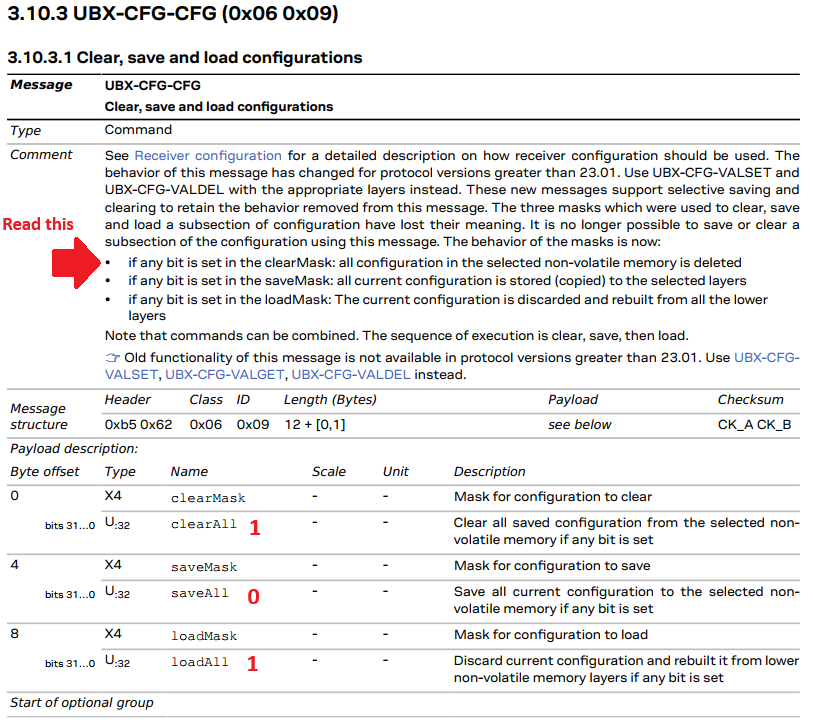
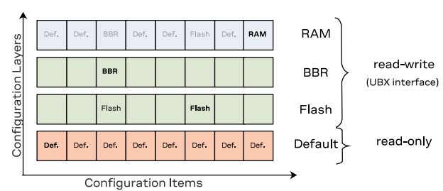
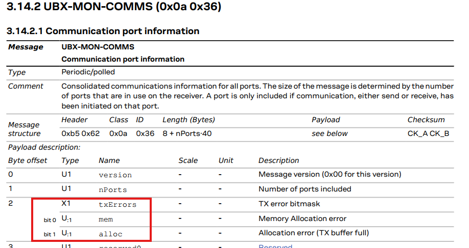
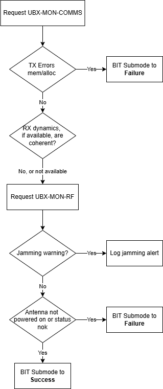

+++
title = "A driver for the Ublox M9: Mode Handling, PBIT"
date = "2026-02-01"
description = "Article explaining the different working modes. In this specific case, the PBIT."
tags = [
    "gnss",
    "ublox",
    "receiver",
    "driver"
]
+++


# The Power-up Built-In Test (PBIT)

The PBIT procedure is a mode run only at driver startup. Its purpose is to run a battery of tests to assert that the system is indeed good to go into Operational mode, or at least that's the definition. In addition to that, the PBIT I've designed is in charge of configuration control. That means the PBIT is in charge of making sure that the RX's configuration is set to the values needed to fulfill the specific application it is intended to carry. For this case it's a low-power positioning that for a static device will only be needed once or twice per day, to check it hasn't been stolen. But it could be the contrary, perhaps you're building a fast-moving vehicle and need a constant high PVT output rate.

Note that the execution of a PBIT will most likely coincide with the startup of the system: the MCU (or PC or whatever) and the Ublox to which it is connected will likely be plugged to the same power source, or maybe the MCU controls the power supply to the receiver. In those cases, you want the driver to start running a few seconds after powering up the receiver. Just after the wake up, you configure it and go on with your life. But it could also be the case that the driver has been ON for days and then the MCU restarts, thus re-running the driver and going over PBIT again. Just be aware that that may happen.

I have prepared a [diagram](#the-full-pbit-diagram) showing the PBIT steps if you want to skip the blabla. If not, here are the steps explained and in chronological order:

1. **Reset configuration** in the BBR (Battery Backed RAM) by sending a UBX-CFG-CFG. The BBR is not not meant to store cfg items, only used (if present) for nav data storage. Thus, the message sent has any bit in the `clearMask` and `loadMask` set to 1, and `saveMask` doesn't:



As you can read from the excerpt, by doing so you are discarding all config in the non-volatile memory selected (you can choose that that with `deviceMask`, it's on the following page), and discarding the current configuration. That is, discard the one that is being actually applied, the one in the RAM layer. Discarding it will rebuild the config from all the lower layers.



If the flash still has non-desirable configuration, rebulding the configuration from the lower layers will still result in non-desirable configuration applied in RAM. But at least not from the BBR. Handling the configuration in the RAM and flash layers will be done by the config control step later.

2. **Request FW version** and look if there's Flash storage installed. The former is done with a UBX-MON-VER and the latter with a UBX-LOG-INFO. Checking if there's a flash is not a test per se, it's just info that needs to be gathered. But checking for the FW version allows you to control the FW version of the Ublox driver that interacts with the driver, and go into fail mode if it's too low.

3. **Request the supported constellations** of the RX. The M9 supports GLONASS, BEIDOU, GPS and GALILEO, but if you reuse this driver for other devices that share a similar interface description, perhaps you could want to ensure that at least it supports, say, "GPS and GALILEO".

4. **Run a Built-In-Test (BIT)** procedure. The BIT is a set of tests that I've encapsulated under its own name because other modes may want to run them too. Those test are:

    4.1. **Check comms status** for critical failures. This is done by sending a request for a UBX-MON-COMMS, and inspecting the reply. You're looking for the bits `mem` and `alloc` under the `txErrors` bitmask. They mustn't be set. If so, the whole RX driver must transition to failure.
    

    4.2. **Check RX dynamics**. Check that the receiver has coherent dynamics with the application at hand. This being a stationary beacon, dynamics shall be somewhat coherent with standing still. Note that the dynamics should take the velocity of the last PVT solution, and depending on who is calling the BIT, there may not be one. As of the writing of this post, this part is TBD.

    4.3. **Check RF status**. This is done by requesting a UBX-MON-RF, and looking in particular at the `jammingState` field. It the RX declares to be in a "3 = critical - interference visible and no fix" situation, log the issue but don't go to failure. Else, don't do anything.

    4.4. **Check antenna status**. No additional message request is required, since the information is present in the UBX-MON-RF previously requested, specifically in the `antStatus` and `antPower` fields. You need to check the antenna status is OK (value 0x02=OK) and its power is on (value 0x01=ON).

    I've laid out the BIT steps as a flow diagram, which may help understand it:

    

5. **Configuration Control**. In the code called `cfg_ctrl`, which I think is way cooler. As the name suggests, this "submodule" is in charge of loading the config database with those config items that deviate from the defaults declared in the [Interface Manual](https://www.u-blox.com/sites/default/files/u-blox-M9-SPG-4.04_InterfaceDescription_UBX-21022436.pdf). Of course, your subset of config items and their values will differ depending on your application-specific use case. `cfg_ctrl` will poll, on different memory layers, the config items you want to edit. If the value is already the one desired, it doesn't do anything. If it isn't, it sets it. And then polls it again to check that it was indeed changed. I'll talk in detail how `cfg_ctrl` works [later](#config-control), but this was the high-level summary. A successful setting of the config database you pass into it will yield a success flag, which will in turn be used by the transition checker (`check_transition_from_PBIT`) to declare the PBIT as successful and move on to another state.

## PBIT transition

Checking for PBIT transition is the last step of the mode, and it is done by the function `check_transition_from_PBIT`. The PBIT mode, in order to keep track which sub-check is being run, has "submodes". For instance, the submode `SubModeReqConstellations` is the one previous to checking the supported constellations, and upon success it goes to run the BIT under `SubModeBITRun`. If all PBIT steps succeed, one will see that the last submode `SubModeASCfgHandler` is flagged as successful. In that case, the PBIT is considered as successful and the driver transitions to Operational mode.

Any check failure in the PBIT will send it into `SubModeFailure`. If the submode isn't fail but isn't successful either, then PBIT is still ongoing. To avoid getting stuck eternally (either due to the receiver being unresponsive or a fail in the `cfg_ctrl`), there's a timeout. If the timeout expires, PBIT is retried up to a number of times. If retries are exhausted and still isn't working, it transitions the driver to fail.

## The full PBIT diagram

I have prepared a diagram showing all the previously defined steps in the PBIT:



## Config Control

As mentioned before, `cfg_ctrl` loads an input database of configuration items. In my implementation, the database is a python dictionary. The dictionary keys are the items that need configuring, as the 4 byte Key ID you can find in the ICD. The corresponding value is another dictionary, which contains:

* The name as a string (in case you want to log the name of the configuration item in a human-readable way).
* The UBX data type, as a character. See more in §5.2 on the ICD. Although this could be inferred from the bits 30...28 of the Configuration Key ID.
* The expected value we want the configuration item to have.
* The actual value the configuration item has. May be marked as unknown.

See below an example:

```python
APP_SPECIFIC_CFG = {
    # CFG-ANA section
    # ---------------------
    0x10230001: {
        "name": "CFG-ANA-USE_ANA",
        "type": "L",
        "expectedVal": False, # Disabled
        "actualVal": CFG_VAL_UNKNOWN,
    },
    [...]
```

Upon giving the config database to `cfg_ctrl`, it will start off with its own "Valget" submode. Here, it will ask the receiver for the actual values that you want to configurate (the ones you passed in the config database) by sending a message UBX-CFG-VALGET. Upon receiving a response, it will loop through all the items for which their actual value is not the one desired. And then transition to its own "Valget" submode. Those items that had a value not equal to the desired one will be put in a list, and a UBX-CFG-VALSET will be sent. Then `cfg_ctrl` will go back to "Valget" submode to assert that it did indeed change the config values with the VALSET, and then flag the procedure as successful, and the PBIT can move on. For more details, I suggest you look at the code or the diagram below:

> **_NOTE:_**  I've skimmed this detail in the explanation to avoid confusion on an already hard algorithm to understand, but Config control will apply your configuration on all memory layers. That includes flash. We know one can not go on doing thousands of writes to flash or it will wear out and stop working. This won't be the case: when running the driver for the first time you will indeed write to flash, but after a reboot, config control will check the flash configuration and not write it if already has the value you wanted.


