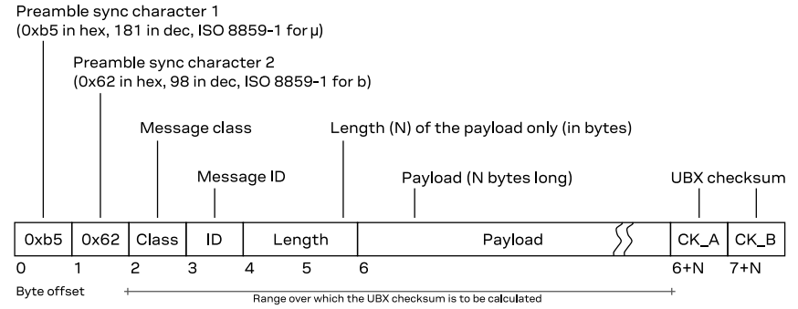
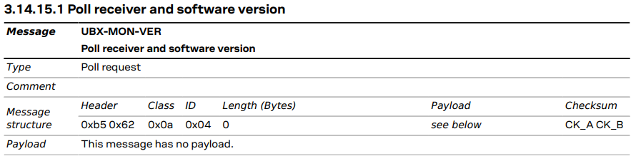

+++
title = "A driver for the Ublox M9: Read the ring"
date = "2026-01-15"
description = "Article explaining the development environment of a driver project for a commercial GNSS receiver. This article specifically explains how data is read from the receiver and its contents parsed."
tags = [
    "gnss",
    "ublox",
    "receiver",
    "driver"
]
+++

In the [last article]() I mentioned that calling `driver.connect()` triggers a thread with the only purpose of reading the serial data and placing it into a buffer ring. A ring buffer (or circular buffer) is a fixed‑size array that treats its ends as connected. When you reach the end, you wrap around to the beginning. This shouldn't happen, of course, since it would mean data loss. You need to to consume faster than loading. In the code I have used Python's `deque` with a maximum length of 1024 bytes. During my testing this has proven to be enough, but it's possible that if you activate the highest refresh rates on many message types at the same time it could loose data.

In this article I will explain the second to last function inside the `Run()` method: `read_rx_ring()`.

```python
def Run(self):
    runStartTs = time.monotonic()

    # Early exit if not running
    if not self.running:
        return

    # Handle priority commands
    self.handle_priority_cmd()

    # Handle current mode actions
    self.handle_mode()

    # Read bytes in ring and process messages
    self.read_rx_ring()

    # Compute Run() execution time and store Worst Case Execution Time (wcet)
    runExecTime = time_diff_from(runStartTs)
    if runExecTime > self.wcet_:
        self.wcet_ = runExecTime
```

## Grab the lock

Before reading from the ring buffer storing the bytes, you need to grab the lock. This will avoid writing data to it while you are popping value. If `_read_loop()` on the other thread is called while you read (thus having the lock), it will wait in the `with self.lock:` until you release it. This behavior can be changed to be non-blocking or have a timeout if that suits your needs.

## Pop bytes

Looking at the way data is pushed into the ring buffer

```python
self.rxRing_.extend( list(self.ser.readline()) )
```

you'll see that the bytes pyserial is returning with the call `readline()` are put one by one into the ring. If, for instance, 5 bytes are received, the 5 are put independently instead of one single bytes instance of 5.

This way, if you look at the code, you can go on popping from the queue chunks of bytes and parsing them in pieces. When no more bytes can be popped from the queue, break from the loop and go on to do something else.

It's important to note that if you intended to read, for instance, 20 bytes from the queue (aka `self.ringBytesToRead_ = 20`) and only 10 bytes are available (ie `bytesRead` is 10), those 10 bytes will be put in the buffer `self.msgBuffer_` but no action will be performed, because you still don't have what you requested. If in the next iteration the queue was filled and the remaining 10 bytes were able to be popped, then an action can be performed.

```python
def read_rx_ring(self):
    with self.lock:
        # Read until emptying the ring
        while True:
            # Read a certain number of bytes from the RX ring into a <class 'bytes'>
            msg = popN(self.rxRing_, self.ringBytesToRead_)
            if len(msg) == 0:
                break
            bytesRead = len(msg)
            # Update bytes to read subtracting the ones read just now
            self.ringBytesToRead_ -= bytesRead

            # Store them into a temporary buffer
            self.msgBuffer_[self.msgIdx_ : self.msgIdx_ + bytesRead] = msg
            self.msgIdx_+= bytesRead

            # All bytes that needed to be read from the ring have been read
            if self.ringBytesToRead_ == 0:
                if self.parserState_ == MsgParserState.eParserNone:
                    self.parseNone()
                elif self.parserState_ == MsgParserState.eParserUBX_SyncChar2:
                    self.parseUbxSyncChar2()
                elif self.parserState_ == MsgParserState.eParserNMEA:
                    self.parseNmea()
                elif self.parserState_ == MsgParserState.eParserUBX_PayloadLen:
                    self.parseUbxPayloadLen()
                elif self.parserState_ == MsgParserState.eParserUBX_Payload:
                    self.parseUbxPayload()
                else:
                    logger.critical("[FAIL] Wrong parser state")
```

## The parser state machine

The main issue is how many bytes to read from the queue, i.e. the class attribute `self.ringBytesToRead_`. The variable is instantiated at 1, so at the very first call of `read_rx_ring` only 1 byte is read. It is stored in a temporary message buffer, which will get parsed by one function or another depending on the parser state. The parser state (machine) is the expected meaning of the incoming bytes. In other words, if the byte just popped is expected to be the header of a message, its payload, or whatever. At the first iteration, being unknown the expected meaning of that 1 byte read, it is parsed as "eParserNone". If you look into the function, you will see that if checks for the first UBX preamble synch char, 0xb5. If the byte equals that, the parser state is moved into the next stage, which is "eParserUBX_SyncChar2". In other words: now the next byte you read will be expected to the the second synch char.



The UBX is not the only protocol used by the receiver. NMEA is also used. It being ascii and starting by '$', the `parseNone` function also checks for that. At the end of the function the variable `self.ringBytesToRead_` is set to 1, meaning that in the next pop we only want 1 byte (again, the second synch char or the next NMEA character).

In the event that the first and second sync characters of the UBX frame structure are found, the bytes to read from the queue at the next iteration are 4: Message Class (1 byte), Message ID (1 byte) and Payload Length (2 bytes). Parser state is changed to `eParserUBX_PayloadLen`.
When parsing that, the first thing to do is check that the Message Class & ID are recognized. They are listed under **§3.8 UBX messages overview** of the ICD, and I've put them in Python as a nested list. The list's first index contains the classes, and each class contains a list with its IDs. This way, checking if a message Class/ID pair exists is as easy as doing:

```python
def validUbxClassAndID(self, msg_class, msg_id):
    return msg_class in SUPPORTED_UBX_MSGS and msg_id in SUPPORTED_UBX_MSGS[msg_class]
```

If the Class and ID pair do exist, the parser is put into the state `eParserUBX_Payload`, meaning that the chunk of bytes to read in the next read loop iteration will be the current message's whole payload. Of course, `self.ringBytesToRead_` is set to whatever value the two last bytes of payload length is. Note that the byte order is little endian and that the payload length does not include the 2 trailing checksum bytes.

The reading of the payload is fairly straight forward. The first thing is to check if the checksum computed from the message is the same as the one in the actual message. Note that the checksum is computed from the Message class byte (byte #2) till the end of the payload. If the checksum matches, the UBX is parsed according to the message class. Each message class has its parsing function, where in turn it will be parsed according to its ID.

Let's take a look at UBX-MON-VER for instance. It's a UBX-MON type of message, so, according to §3.14 *"The messages in the UBX-MON class are used to report the receiver status, such as hardware status or I/O subsystem statistics."* Going to §3.14.15.1, you can see that it will *"Poll receiver and software version"* if the user send this type of message



And sending it is as easy as this snippet

```python
def req_mon_ver(self):
    msg = struct.pack('>HBBHBB', 0xB562, 0x0A, 0x04, 0x0000, 0x0E, 0x34)
    self.send_command(msg)
    self.cmds.bPendingMonVer_ = True
```

Note that since the polling message doesn't have anything in the payload that is dynamic or can vary, the checksum for this message will always be the same. You can compute it by hand calling the function `computeUbxCRC`. But the neat trick is letting u-center compute it for you.

If you are a visual learner like me, I've drawn a diagram of the parser state machine below. I think it's easier to understand rather than looking at the code.




### Wait a minute...

You may be asking *that parsing method is all good and well when no bytes are lost, but what if they do?* Let's analyze what would happen if a byte (or more than one) is lost at any point:

* Byte lost at `eParserNone`: if byte read was going to be the 1st synch char but got lost, the loop will keep on reading messages until it reaches the next message. If that one is not corrupted, it will parse it.
* Byte lost at `eParserUBX_SyncChar2`: synch char 1 was read, and then but should have been synch char 2 got lost/corrupted. In that case, parser will back to mode `eParserNone` and keep reading bytes one by one until it find a synch char 1 again at the next message.
* Byte lost at `eParserUBX_PayloadLen`: if byte is lost/corrupted in any of the 4 bytes that compose Class/Id and Payload Length, the most likely scenario is that Class, ID or both are not recognized. If Payload Length is wrong, then the parser will go on to `eParserUBX_Payload` with a wrong length, which will cause a checksum miss. This will discard the message and put the parser back to `eParserNone`.

### You didn't talk about NMEA parsing...

If the incoming message is an NMEA, the decoding is byte by byte. This can be seen in the `parseNmea` function:

```python
def parseNmea(self):
    # NMEA msg end chars reached, else keep on storing chars in the buffer
    if self.msgBuffer_[self.msgIdx_ - 2] == ord(NMEA_END_CR_CHAR) and \
       self.msgBuffer_[self.msgIdx_ - 1] == ord(NMEA_END_LF_CHAR):
        # Whole NMEA message is in buffer, now decode its data
        self.decodeNMEA()

        self.parserState_ = MsgParserState.eParserNone
        self.msgIdx_ = 0

    # With NMEA messages always read byte per byte
    self.ringBytesToRead_ = 1
```

Only when the two end chars are found you can proceed to decode the NMEA as a string. I will not focus on this because the driver's comms are designed to be via UBX only.

## What's up next

I think I've covered most of the RX message reading/parsing. Next blog entry will cover the RX mode handling. Since it is quite big, I'll break into parts.

